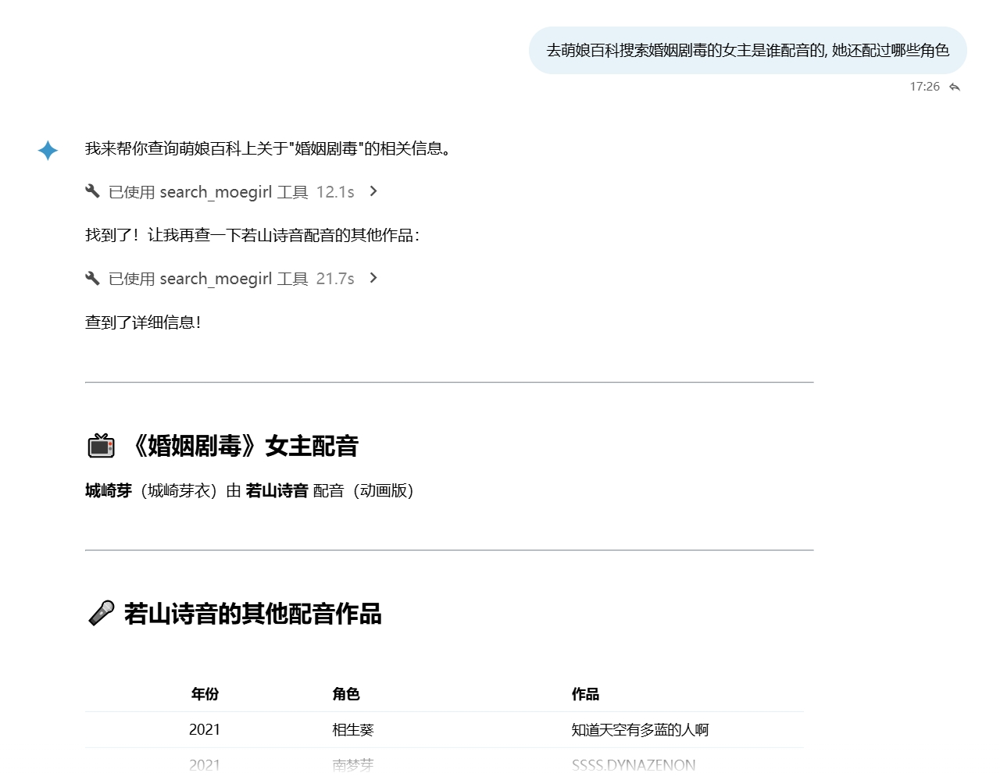
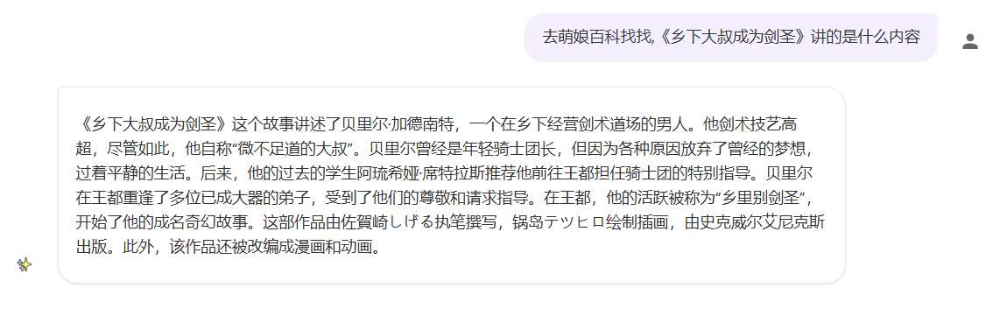

# anime gacha  
获取今日更新番剧 & 随机推荐经典老番 & 萌娘百科搜索 & 番剧信息查询

## ✨ 最近更新
### v1.1.3
- 适配了2026年04月新番的页面爬取
- 移除了 /萌娘百科 指令，修改了萌娘百科搜索的tool，让agent搜索内容效率更高

## 📦 安装
需要安装依赖：
```
pip install -r requirements.txt
```

## 📝 指令说明
| 指令           | 说明                  | 示例               |
|--------------|---------------------|------------------|
| `/抽番`        | 随机推荐经典老番            | `/抽番`            |
| `/今日新番`      | 获取当日更新的新番列表         | `/今日新番`          |
| `/查番 名称`     | 查询番剧详细信息(注意番名不能有空格) | `/查番 avemujica`  |
| `/检查番剧数据`     | 检查当前已有和缺少的番剧数据      | `/检查番剧数据`  |
| `/更新番剧数据 季度` | 更新指定季度的番剧数据         | `/更新番剧数据 202501` |
(注: 执行指令`/今日新番`时会更新当前季度的数据, 但每12小时才会更新一次)

### 萌娘百科搜索工具
该功能结合两种途径进行搜索:
1. 萌娘百科网页搜索：[https://zh.moegirl.org.cn/index.php?search=doro](https://zh.moegirl.org.cn/index.php?search=doro)
2. 萌娘百科MediaWiki API：[https://zh.moegirl.org.cn/api.php](https://zh.moegirl.org.cn/api.php)
- 可能存在的问题：
  - 访问`萌娘百科网页搜索`可能需要验证，这时会只依靠`萌娘百科MediaWiki API`的搜索结果回答
  - `萌娘百科MediaWiki API`对搜索关键词比较敏感，需要给大模型提供更准确的搜索关键词

#### 效果展示



## 🔗 数据来源
- **新番数据**：[長門番堂](http://yuc.wiki/)
- **推荐内容**：[AGE动漫](https://github.com/agefanscom/website)
- **搜索范围**：[萌娘百科](https://zh.moegirl.org.cn/)

